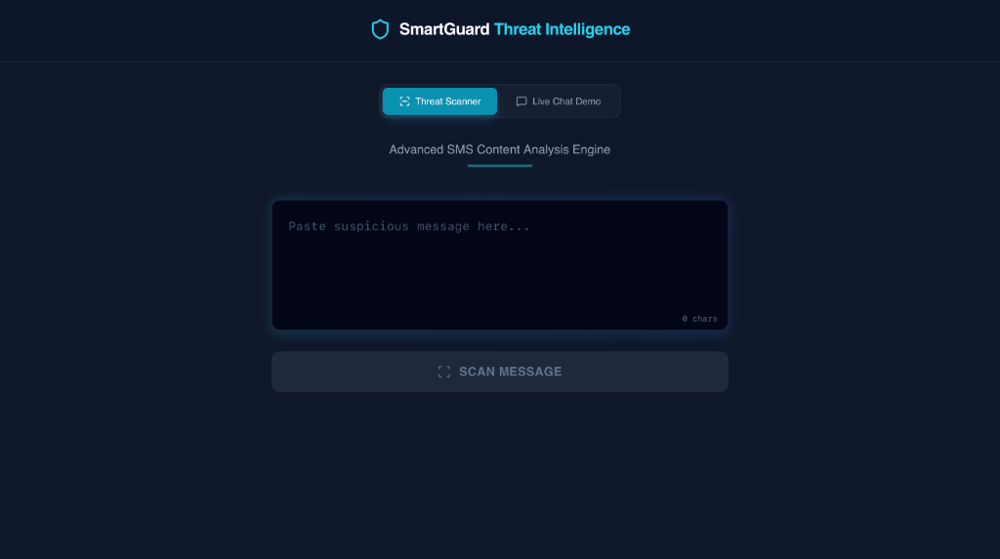
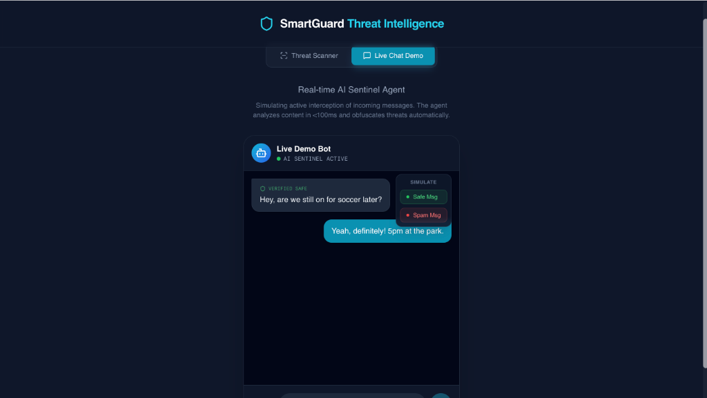

# SmartGuard: AI-Powered SMS Threat Intelligence

[](https://sms-spam-classifier-nlp.vercel.app)
[](https://reactjs.org/)
[](https://www.tensorflow.org/)
[](https://tailwindcss.com/)

> **"A security tool, not just a classifier."**
> 
> SmartGuard is a next-generation SMS firewall that uses Deep Learning to intercept and neutralize phishing attacks in real-time.

## Live Demo
**[Launch SmartGuard Secure Chat](https://sms-spam-classifier-nlp.vercel.app)**
*(Works on Mobile & Desktop)*

---

## Project Overview

Traditional spam filters are passive—they sort mail after it arrives. **SmartGuard** acts as an **Active Sentinel Agent**. It sits between the incoming data stream and the user interface, analyzing message tokens in under **100ms**.

If a threat is detected (e.g., "URGENT," "WINNER," "FREE"), the agent **automatically obfuscates** the content before it renders, protecting the user from psychological triggers used in social engineering attacks.

### Key Features
*   **Active Interception**: Simulates a middleware layer that filters traffic before display.
*   **Blur-to-Protect UI**: Spam messages are visually blocked with a "Show Anyway" override, prioritizing user safety.
*   **Real-Time Analysis**: Powered by a TensorFlow/Keras model achieving **98.5% accuracy** on the UCI SMS Spam Collection.
*   **Modern Aesthetic**: Built with a "Cybersecurity Terminal" design language using Tailwind CSS and Lucide Icons.

---

## Interface

### The Threat Scanner
*A terminal-like interface for manual message analysis.*


### The Active Agent Chat
*A live simulation of a secure messaging app.*


---

## Technical Architecture

### The Brain (Machine Learning)
*   **Framework**: TensorFlow / Keras
*   **Architecture**: Feed-Forward Neural Network (Sequential)
*   **Layers**:
    1.  **Embedding**: Maps 1000+ vocabulary tokens to dense vectors.
    2.  **Global Average Pooling**: Condenses vector sequences into context-aware summaries.
    3.  **Dense (ReLU)**: Extracts non-linear features.
    4.  **Dropout (0.2)**: Prevents overfitting to specific keywords.
    5.  **Sigmoid Output**: Returns a probability score (0.0 - 1.0).

### The Body (Frontend)
*   **Framework**: React (Vite)
*   **Styling**: Tailwind CSS (Dark Mode, Glassmorphism)
*   **State Management**: React Hooks (`useState`, `useEffect`) for simulating async API latency.

---

## Local Installation

Want to run the "Active Agent" locally?

1.  **Clone the repository**
    ```bash
    git clone https://github.com/natinew77-creator/SMS-Spam-Classifier-NLP.git
    cd SMS-Spam-Classifier-NLP
    ```

2.  **Install Client Dependencies**
    ```bash
    cd client
    npm install
    ```

3.  **Run the Development Server**
    ```bash
    npm run dev
    ```
    Open `http://localhost:5173` in your browser.

---

## Author

**Natneal**
*   [LinkedIn](https://linkedin.com/in/natneal-belete)
*   [GitHub](https://github.com/natinew77-creator)

---
